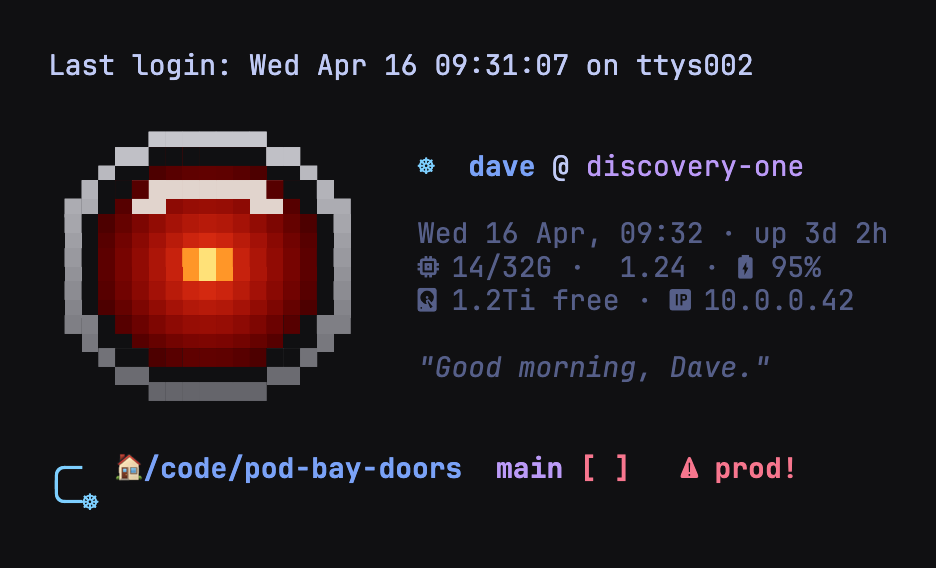

# dotfiles


My Mac terminal setup: **Ghostty** + **Starship** + **eza** + the **TokyoNight** Claude Code statusline.

> Syncing to another Mac or making changes? See **[HOWTO.md](HOWTO.md)** for how changes
> propagate (symlinked configs are instant; packages/aliases need a `bootstrap.sh` re-run).

## The Ghostwheel (Amber) stuff



*(Screenshot is staged — `matthew @ amber`, `chainproof-ledger`, and the stats come from `docs/motd-shot.zsh` against a throwaway `$HOME`, not a real machine.)*

The resident intelligence is **Ghostwheel** — "Ghost" — Merlin's construct from Roger
Zelazny's *Chronicles of Amber*, a spinning wheel of light that maps Shadow. A terminal
is a threshold; opening one is walking the Pattern. Every new shell, Ghost greets me by
name beside a truecolor braille emblem (a static 32×16 `.ansi`, read with zsh's `$(<file)`
builtin — ~0.1 ms, no image protocol, portable over SSH/tmux). To its right: live stats
(memory, load, battery, disk, LAN IP) plus a static OS/chip identity line. Battery and disk
turn red when low.

Ghost's greeting has three moving parts, all spare and hand-written — no random wisdom:

- a **time-aware line** (morning/afternoon/evening; after dark by `America/Chicago` it
  invokes **Tir-na Nog'th**, the city that appears only by moonlight)
- one **rotating Amber texture line** — the Pattern, hellriding through Shadow, Kolvir,
  the Trumps — drawn from a small curated set, rotating *daily* so it never flickers
- the **Shadow I ride toward**: the day's intent, set with `walk` (below); if none is set,
  Ghost asks which Shadow I mean to walk to

**`walk` — the intention mechanic** (in `config/hal.zsh`, stored at `~/.amber/shadow`):

```bash
walk "ship the chainproof ledger spec"   # set the day's Shadow
walk                                      # show the current Shadow
walk --arrived                            # clear it, in-world
```

Ghost also has hands in the shell: command-not-found answers in character, a `≥30s`
command fires a macOS notification, and past prompts collapse to a single `✶ cmd` line so
scrollback stays clean.

The **prompt carries Ghostwheel's eye** (`config/starship.toml`): the `╰─☸` keel, and on a
failed command the keel becomes the red eye `╰─◉` with *"that Shadow won't yield, Dad"* and
the exit code on the top line. Wrangler repos still show a Cloudflare badge that flips to a
red **⚠ prod!** on main/master.

Escape hatches: `export MOTD_EMBLEM=0` (plain stacked greeting, no emblem) and
`export TRANSIENT_PROMPT=0` (keep full prompts in scrollback). The retired HAL 9000 eye
lives on in `config/hal9000.sh` — `~/.config/hal9000.sh 19` still renders it full-size.

## One-command setup on a new Mac

```bash
git clone https://github.com/vajramatt/dotfiles.git ~/dotfiles
~/dotfiles/bootstrap.sh
```

Then open a new terminal (or `exec zsh`).

## What `bootstrap.sh` does

1. Installs **Homebrew** if it's missing.
2. `brew install starship jq eza zsh-autosuggestions zsh-syntax-highlighting` and `brew install --cask ghostty font-jetbrains-mono-nerd-font`.
3. Symlinks the configs into place (backing up anything already there to `*.bak.<timestamp>`):
   - `~/.config/starship.toml` → two-line prompt: `╭─` directory + git branch/status + runtime versions/clock, then the `╰─☸` keel
   - `~/.config/ghostty/config` → TokyoNight Night theme + `JetBrainsMono Nerd Font Mono`
   - `~/.config/motd.sh` (+ `~/.config/ghostwheel_amber.ansi`) → TokyoNight MOTD on every new terminal: the Ghostwheel emblem beside user@host, OS/chip identity, date/uptime, memory/load/battery, disk/LAN IP, a time-aware greeting (Tir-na Nog'th after dark), a rotating Amber line, and the Shadow you ride toward; low battery/disk turn red (`export MOTD_EMBLEM=0` for the plain greeting)
   - `~/.config/hal.zsh` → zsh extras: `walk` (sets the day's Shadow), transient prompt (old prompts collapse to `✶ cmd`; `export TRANSIENT_PROMPT=0` to disable), command-not-found in Ghost's voice, macOS notification when a command runs ≥30s
   - `~/.claude/hooks/statusline.sh` → TokyoNight statusline for Claude Code
4. Merges the `statusLine` block into `~/.claude/settings.json` (rest of the file is left untouched; a `.bak` is kept).
5. Ensures `~/.zshrc` sources **zsh-autosuggestions** (fish-style ghost text), `eval "$(starship init zsh)"`, the **eza** aliases (`ls`/`la`/`ll`/`lt`), the **MOTD** greeting, and **zsh-syntax-highlighting** (sourced last, as it requires).

It's **idempotent** — safe to re-run.

## Layout

```
config/
  starship.toml          # Starship prompt (still HAL: ☸ keel, ◉ red eye on failure)
  ghostty/config         # Ghostty terminal
  motd.sh                # Ghostwheel (Amber) MOTD greeting (sourced from ~/.zshrc)
  ghostwheel_amber.ansi  # the 32×16 truecolor braille emblem, read by motd.sh
  hal9000.sh             # retired HAL 9000 eye (zsh-rendered; standalone, unused by the MOTD)
  hal.zsh                # walk + transient prompt + Ghost command-not-found + long-command notifications
claude/
  hooks/statusline.sh    # TokyoNight statusline
docs/
  banner.mjs             # regenerates banner.svg (figlet + TokyoNight gradient, zero deps)
  banner.svg             # the README banner
  motd-shot.zsh          # captures motd.sh with staged demo data -> motd.ansi
  motd-shot.mjs          # renders motd.ansi -> motd.png via headless Chrome
  motd.png               # the README screenshot (staged: matthew@amber, fake stats)
bootstrap.sh
```

## Editing

Configs are **symlinked**, so editing a file under `~/.config` / `~/.claude/hooks` edits the
repo copy directly. Commit and push to sync:

```bash
cd ~/dotfiles && git add -A && git commit -m "tweak config" && git push
```

## Credits

- Statusline: [vajramatt/claude-tokyonight-statusline](https://github.com/vajramatt/claude-tokyonight-statusline)
- [Starship](https://starship.rs) · [Ghostty](https://ghostty.org) · [TokyoNight](https://github.com/folke/tokyonight.nvim)
